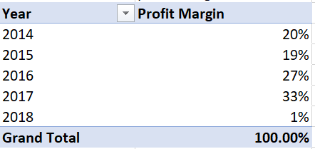

# United States Superstore Sales Analysis
## Introduction
This task is to demonstrate analysis of US superstore sales data using advanced Excel functions such as a pivot table, and pivot chart, the analysis requirements are to develop six questions and a maximum of four KBIs.
## Problem Statement
What is the total revenue and profit for the superstore sales data?
What is the largest customer segment by revenue?
Which product category generates more revenue?
What are the most popular shipping modes?
Which regions are the most profitable?
What are the top-selling products by region?

## DATA SOURCING
This data was obtained from the superstore Sales data in the Data Analytics. The data contains 1 sheet which has a table containing 8,159 rows and 27 columns
## DATA TRANSFORMATION & CLEANING
The data was cleaned and filtered to make it easier to analyze. This included formatting the text and number types to ensure the data would not return errors.

## Analysis & Visualisation
## What is the total revenue and profit for the superstore sales data?
The company's sales and profits grew steadily from 2014 to 2017, reaching their highest levels in 2017. However, sales and profits fell below expectations in 2018.

Table                               |          Chart
:----------------------------------:|:----------------:
         |     

## What is the largest customer segment by revenue?
The customer segment is the largest and it had the highest sales from 2014 to 2017, but sales for all three segments fell in 2018.

Table                               |          Chart
:----------------------------------:|:----------------:
         |     

## Which product category generates more revenue?
Technology products brought in the most money from 2014 to 2018, with a total of $836,154 in revenue.
Table                               |          Chart
:----------------------------------:|:----------------:
                  |     

## What are the most popular shipping modes?
Standard class shipping is the most popular shipping option, accounting for nearly 60% of all revenue from other shipping classes.

Table                               |          Chart
:----------------------------------:|:----------------:
               |     

## Which regions are the most profitable?
The chart and table show that the West region generates the most revenue, followed by the East region
Table                               |          Chart
:----------------------------------:|:----------------:
                  |     

## What are the top-selling products by region?
Office supplies are the most popular products sold in all regions, with 6,026 sales records.
Table                               |          Chart
:----------------------------------:|:----------------:
              |     

# Key Performance Indicator 

## What is the revenue by product and top ten states?
California and New York are the top two states by revenue, generating the highest revenue of all 50 states.
Table                               |          Chart
:----------------------------------:|:----------------:
           |     

## What is the annual profit margin?
The overall trend in profit margins appears to be positive from 2014 to 2017, with increasing percentages. However, the sharp drop in 2018 is a significant issue. It would be important to investigate the reasons behind this drop in profitability
Table                               |          Chart
:----------------------------------:|:----------------:
           |     

## What is the effect of promoting discounts on revenue?
The analysis above shows that the more the company offers discounts, the more revenue it generates.
Table                               |          Chart
:----------------------------------:|:----------------:
           |     

## What is the revenue generated by category over the years 2014 to 2018
Table                               |          Chart
:----------------------------------:|:----------------:
           |     

